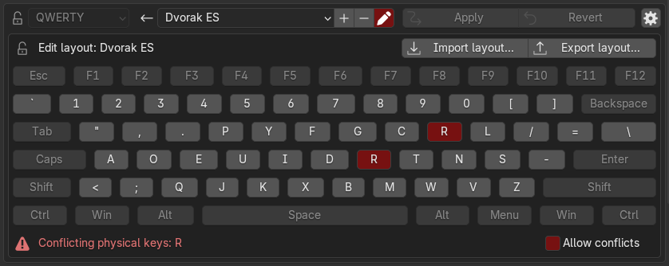

## Defining your own keyboard layout
This extension provides several built-in keyboard layouts:

- QWERTY (default, standard US-QWERTY)
- Dvorak (standard US-Dvorak)
- Colemak
- AZERTY (French)
- QWERTZ (German)

Usually, you select these layouts in the **input** keyboard layout dropdown
from the top bar injected by this extension in the `Preferences > Keymap` menu.

To define your own keyboard layout, you must first give it a name.
To do so, press the `+` button besides **input** keyboard layout dropdown.
> Do not confuse this with the button to create a new keymap preset.

You may first select the closest built-in layout in the dropdown,
to use it as an initial value.

Once you have chosen a name, press the pencil button besides the `+`/`-` buttons to
reveal the keyboard layout editor.

Next, reassign all the keys you need in the editor.
Press any key and immediately type its corresponding key on your layout to reassign it.
> Blender cannot internally represent most non-standard keys.
> For example, pressing `'` (the apostrophe key), even on the default US-QWERTY layout,
> will display `"` in Blender (QUOTE).
> 
> This extension cannot do anything about this problem.
> If Blender does not recognize some keys of your layout as keys at all,
> this extension cannot help you.
> Instead, you should [report a bug](https://projects.blender.org/blender/blender/issues/new/choose)
> to Blender and request the team to add support for your keyboard.
> 
> Ideally, Blender should be able to support any and all keys, present and future,
> but the current keymap system was designed poorly, implemented even more
> poorly, and has been awaiting a complete redesign for a long time.
> Unfortunately, no one is motivated enough to tackle this problem.
 
If your keyboard layout is recognized in Blender in a way that it contains
two keys corresponding to the same Blender recognized key (for example,
if your layout contains separate keys for `'` and `"`), you may still
apply the keyboard layout emulation.
The extension remembers which was the original assignment of each remapped
shortcut to be able to revert the emulation reliably even in this case.

However, in this case, you will need to enable the `Allow conflicts` checkbox
displayed below the keyboard layout editor.
Naturally, in this case you will have two keys in your layout that trigger the same
shortcut, since Blender cannot distinguish those two keys at all.
