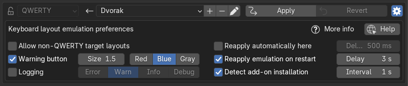
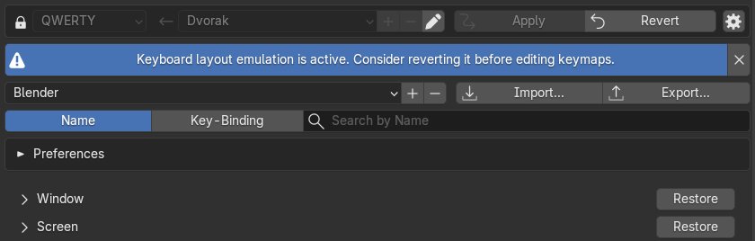
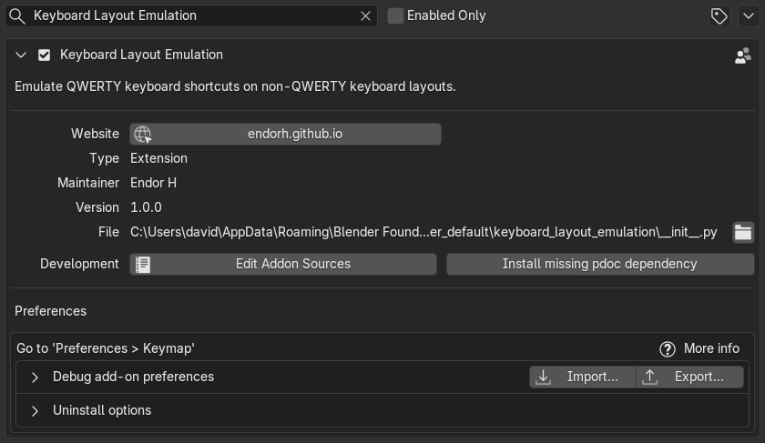
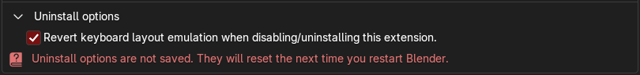

## Keyboard Layout Emulation Preferences
This extension exposes several preferences in the `Preferences > Keymap` panel.
To reveal them, press the preferences icon in the top right corner.

- [Emulation settings](#emulation-settings)
    - [Reapply emulation on restart](#reapply-emulation-on-restart)
    - [Detect add-on installation](#detect-add-on-installation)
    - [Reapply automatically here](#reapply-automatically-here)
- [Interface settings](#interface-settings)
    - [Allow non-QWERTY target layouts](#allow-non-qwerty-target-layouts)
    - [Warning button](#warning-button)
    - [Logging level](#logging-level)
- [Import preferences](#import-preferences)
- [Uninstall options](#uninstall-options)

### Emulation settings
#### Reapply emulation on restart
By default, emulation is reapplied every time you restart Blender.
This ensures that even keyboard shortcuts added by other add-ons are reliably
remapped.

By default, this is done twice, once as soon as Blender loads, and a second time
a few seconds later, to ensure that we remap even keyboard shortcuts added
in after our add-on is registered.
You may configure this delay or set it to 0 to only reapply emulation once
on restart.

We track the shortcuts we remap to avoid remapping any shortcut twice.

#### Detect add-on installation
By default, whenever you install or enable another add-on, we detect it and
automatically apply the emulation to ensure that its keyboard shortcuts are
also remapped.

This is done by injecting draw hooks onto the `Preferences > Add-ons` and
`Preferences > Get Extensions` panels, which trigger a check for changes
in the list of add-ons that only runs at most every few seconds.
You may configure this polling interval or set it to 0 to check for changes
on every draw event.

This means that the check only runs when either of these menus are open,
and you interact with them in any way (including hovering the mouse over
buttons), but at most every few seconds, to ensure that the performance
impact is negligible.

#### Reapply automatically here
There are some situations where Blender unfortunately resets some
keyboard shortcuts.
For example, some shortcuts, such as `node.duplicate_move` are
sometimes reset when you modify other keyboard shortcuts.

When this happens, the `Apply` button in the `Preferences > Keymap` panel
will be re-enabled to let you `Re-Apply` the emulation immediately.

Alternatively, you may choose to automatically re-apply the emulation
when this button would be shown in this state (make the button click itself).
You may configure the delay before the button is automatically clicked if
it annoys you.

By default, this feature is disabled.

### Interface settings
#### Allow non-QWERTY target layouts
By default, the **target** keyboard layout selector is disabled, since
most users will never need to change it.

If you want to use a keymap preset designed for a non-QWERTY keyboard layout,
different from the one you use, you can enable this option and change
the **target** keyboard layout.

#### Warning button
By default, whenever emulation is active, a wide warning button is displayed
above the keyboard shortcuts editor, to let you know that you should
disable emulation before editing any keyboard shortcuts.

This is because, while we can track which keyboard shortcuts we have remapped,
this tracking may become broken when you edit a keyboard shortcut yourself,
since we cannot track your modifications.

Hence, modifying keyboard shortcuts while emulation is active may result
in some shortcuts being remapped a second time on the next Blender restart.

You may hide or change the aspect of this warning button to make it easier to
bear or harder to miss.

#### Logging level
By default, only errors and warnings are logged in Blender's System Console.
If you are troubleshooting an issue with this extension, you may want to
increase the logging level to see read more detailed logs when emulation is
applied or reverted.

### Import preferences
You may export and import the preferences for this extension from the
`Preferences > Add-ons` menu.
Search for `Keyboard Layout Emulation` and expand the preferences for this extension.

Use the `Import...` and `Export...` buttons in the `Debug add-on preferences` section.

### Uninstall options
By default, whenever you uninstall this extension, the emulation is automatically
reverted to avoid damaging your keymaps.

If you want to uninstall the extension without reverting the applied emulation,
you can use uncheck the checkbox in the `Uninstall options` of this add-on
within `Preferences > Add-ons > Keyboard Layout Emulation`.
