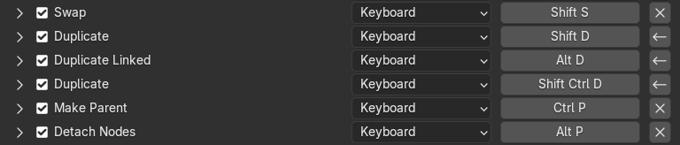

# Using Keyboard Layout Emulation
!!! info "Ensure you have [installed](installation.md) the extension."

Navigate to `Preferences > Keymap`.
You should see a bar on top of the keymap preset selector with two
keyboard layout selectors, which default to QWERTY, followed by an
`Apply` and a `Revert` button.

There is also a gear button on the right end of the bar to reveal
the keyboard layout emulation [preferences](preferences.md).

## Quick Setup
!!! abstract "Setup in 3 clicks"
    1. Choose your preferred keyboard layout in the center dropdown menu.
    2. Press the `Apply` button.
    3. Observe how all the keyboard layouts below have been remapped accordingly.
       They will remain remapped until you press the `Revert` button again
       or disable/uninstall the extension.

!!! info "If you cannot find your preferred keyboard layout in the dropdown, you may also [define your own](defining-your-own-keyboard-layout.md)"

## User Interface
### Target keyboard layout selector
The leftmost dropdown in the top bar lets you choose a **target** keyboard layout.

!!! note "For most purposes, this should be left as QWERTY."
    This should be set to match the keyboard layout for which the keymap preset
    you are remapping was designed for.
    
    To avoid an easy beginner mistake, this field is locked by default.
    You can enable it in the [preferences](preferences.md#allow-non-qwerty-target-layouts).

### Input keyboard layout selector
The second dropdown in the top bar lets you choose your **input** keyboard layout.

!!! info "This is where you choose your preferred keyboard layout."

This value will be used to determine how the keyboard shortcuts should be remapped
so that your input is interpreted as if it was typed on the **target** layout rather
than your actual layout.

### Keyboard layout editor
Besides the **input** keyboard layout selector, there are `+` and `-` buttons,
and a pencil button.
These let you define your own keyboard layouts and edit them.
Press the pencil button to reveal the keyboard layout editor.

!!! quote "No, I do not use the Spanish Dvorak layout, it's just a convenient example."

!!! question "How can I edit a built-in layout?"
    Built-in layouts cannot be edited. Create a copy using the
    `+` button, and give it a different name before editing it.

In the keyboard layout editor, press any key and subsequently type the key
it should correspond to on your layout to reassign it.
Press `Escape` or click anywhere to cancel reassigning a key.
Changes are immediately saved in the selected layout.

!!! tip
    You may also use the `Import layout...` and `Export layout...` buttons to
    import or export keyboard layouts as simple JSON files containing a mapping
    of characters.

!!! info "See more on [defining your own keyboard layout](defining-your-own-keyboard-layout.md)"

### Applying and Reverting keyboard layout emulation
The `Apply` button enables keyboard layout emulation.

The emulation remaps all your keyboard shortcuts in a way that
pressing the corresponding QWERTY shortcut on your non-QWERTY
keyboard layout still triggers the action designed for QWERTY
layouts (e.g., pressing `O` in Dvorak will trigger `S` (Scale)).

!!! info
    This will not affect the text you input in properties, search fields
    nor the text editor, so you can still type on your preferred keyboard layout.

!!! warning "Under the hood this is not a simple *apply and forget* operation"
    Once applied, the extension will remember this and reapply the remapping
    every time you restart Blender, open a new file, or install a new extension.
    This is necessary to ensure that keyboard shortcuts defined by other extensions
    are also reliably remapped.
    The performance impact of reapplying emulation is usually imperceptible.
    
    Every remapped shortcut is remembered by the extension to avoid remapping
    the same shortcut twice over, as well as to ensure that we can reliably
    revert the remapping.
    The journal of remapped shortcuts is reasonably compressed and, for a
    factory Blender installation is usually under 100 KiB in size.
    
    The extension tries to ensure that you'll never have to worry about it until
    you want to make changes to your keymap.

The `Revert` button reverts the remapping, until you apply it again.

## Gotchas
There are a few shortcuts (e.g., `Node Editor (Global) > Duplicate`)
that experience glitches in Blender, even if you remap them yourself as a user.

You may notice that when you revert emulation, these shortcuts may appear as if they were
still modified, but if you inspect them closely, you will observe that they have been
properly reverted.
This appears to be a bug in Blender in the process of comparing these shortcuts to their
default values.
